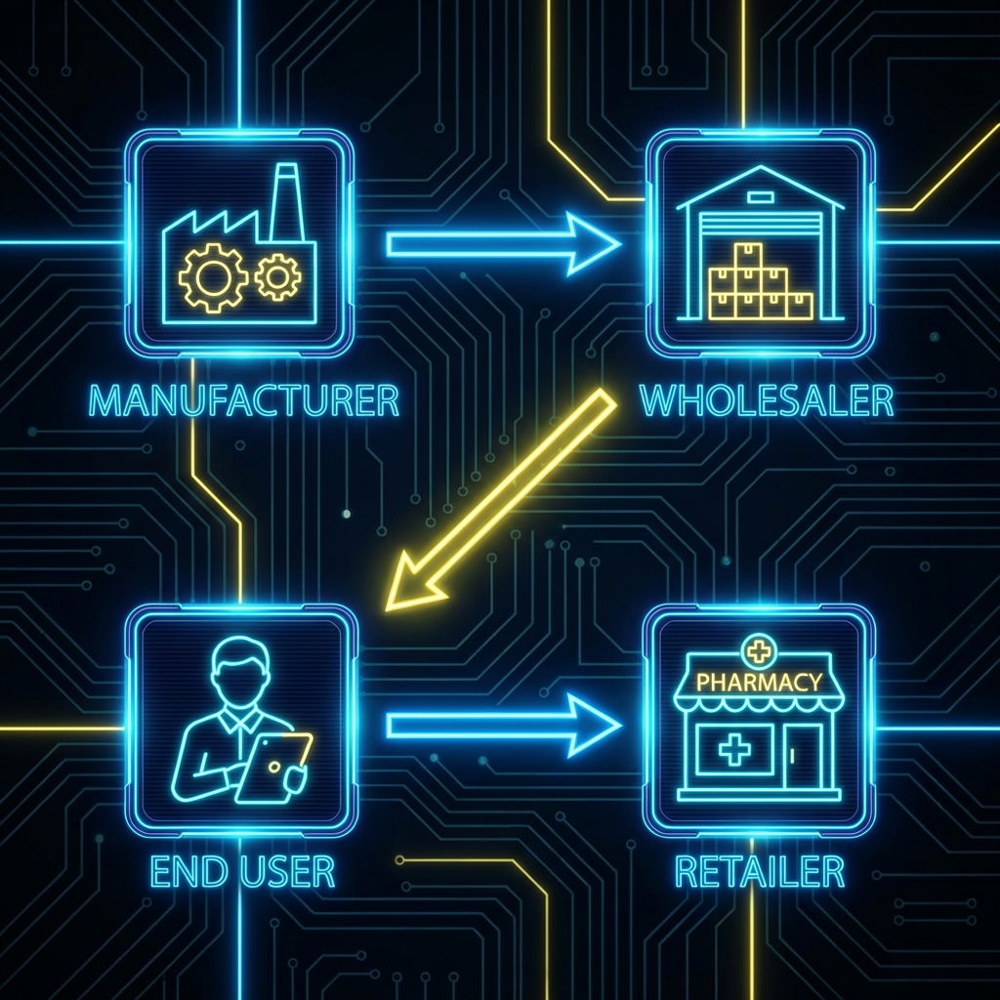

# PharmaTrace: Secure Pharmaceutical Supply Chain

## Overview
PharmaTrace is a decentralized application (DApp) designed to bring transparency and security to the pharmaceutical supply chain. Built on the Ethereum blockchain, it tracks the journey of medicines from the manufacturer to the end-user (patient), preventing counterfeiting and ensuring product authenticity.

## Key Features
- **Immutable Tracking**: Every transfer is recorded on the blockchain.
- **Role-Based Access**:
  - **Manufacturer**: Registers new medicines.
  - **Wholesaler (Distributor)**: Receives from manufacturer and passes to retailer.
  - **Retailer (Pharmacy)**: Receives from wholesaler and sells to patient.
  - **End User (Patient)**: Verifies authenticity and history.
- **Expiration & Validity Checks**: Automatic checks for expiration dates.
- **Digital History**: Patients can view the entire "hopping" history of the medicine.

## Supply Chain Workflow
1. **Manufacturing**: Valid items are created with a unique Serial Number and Product Code.
2. **Distribution**: Items move through the chain (Manufacturer -> Wholesaler -> Retailer).
3. **Sale**: Retailer transfers ownership to the Patient.
4. **Verification**: Patient checks status (Valid/Expired/Fake) and views history.

## Technology Stack
- **Blockchain**: Solidity (Smart Contracts)
- **Frontend**: HTML5, CSS3 (Modern Dark UI), JavaScript
- **Web3 Interaction**: Ethers.js, MetaMask

## How to Run
1. **Prerequisites**:
   - Install [MetaMask](https://metamask.io/) browser extension.
   - Access to a local blockchain (Hardhat/Ganache) or a Testnet (Sepolia/Goerli).

2. **Deploy Smart Contract**:
   - Deploy `pharma_supplychain.sol` using Remix or Hardhat.
   - Copy the deployed contract address.

3. **Configure Frontend**:
   - Open `APP.js`.
   - Update `contractAddress` with your deployed address.
   - Ensure you are connected to the correct network offering the contract.

4. **Launch**:
   - Open `INDEX.html` in a live server (e.g., VS Code Live Server).
   - Connect your Wallet and start interacting!

## Application Screenshots

Here are some previews of the application interface:

### Dashboard & Interface
|   |   |
|---|---|
|  |  |
|  |  |

---
*Built with security and transparency in mind.*
